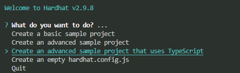

# Hardhat Test Tutorial

This guide is intended to provide a step-by-step tutorial for writing solidity contracts hardhat tests within Degis project development. The goal of this guide is to quickly setup a basic file and give some guidance on some decisions a developer might have to take since writing automated tests when building smart contracts is of crucial importance, as your user's money is what's at stake.

[Hardhat Network](https://hardhat.org/) is a local Ethereum network designed for development that is built-in and the default network in Hardhat. You don't need to setup anything to use it. In our tests we're going to use [ethers.js](https://docs.ethers.io/v5/) to interact with Ethereum contracts, and [Mocha](https://mochajs.org/) as our test runner. For BDD assertions Degis uses the `expect` pattern by the [chai](https://www.chaijs.com/) library.

## Starting Project

If working on a project already initialized, skip this section.
Initial project and environment setup are standardized in Degis project development. They should be initialized from the advanced, typescript sample project on hardhat. Hardhat requires `Node.js`.


### Initializing Project

To initialize a node.js project start by running:

> npm init

Fill in required fields.

Install Hardhat and initiate a hardhat project:

> npm install --save-dev hardhat

> npx hardhat

select `Create an advanced sample project that uses TypeScript`



Hardhat is unopinionated in terms of what tools you end up using, but it does come with some built-in defaults but Degis requires several dependencies to install. 

Run the suggested dependencies by hardhat or the following command to install them:

> npm install --save-dev "hardhat@^2.9.8" "@nomiclabs/hardhat-waffle@^2.0.0" "ethereum-waffle@^3.0.0" "chai@^4.2.0" "@nomiclabs/hardhat-ethers@^2.0.0" "ethers@^5.0.0" "@nomiclabs/hardhat-etherscan@^3.0.0" "dotenv@^16.0.0" "eslint@^7.29.0" "eslint-config-prettier@^8.3.0" "eslint-config-standard@^16.0.3" "eslint-plugin-import@^2.23.4" "eslint-plugin-node@^11.1.0" "eslint-plugin-prettier@^3.4.0" "eslint-plugin-promise@^5.1.0" "hardhat-gas-reporter@^1.0.4" "prettier@^2.3.2" "prettier-plugin-solidity@^1.0.0-beta.13" "solhint@^3.3.6" "solidity-coverage@^0.7.16" "@typechain/ethers-v5@^7.0.1" "@typechain/hardhat@^2.3.0" "@typescript-eslint/eslint-plugin@^4.29.1" "@typescript-eslint/parser@^4.29.1" "@types/chai@^4.2.21" "@types/node@^12.0.0" "@types/mocha@^9.0.0" "ts-node@^10.1.0" "typechain@^5.1.2" "typescript@^4.5.2"

 


Go to hardhat.config.ts and substitute its content for the following:

 

```
import * as dotenv from "dotenv";

import { HardhatUserConfig } from "hardhat/config";
import "@nomiclabs/hardhat-etherscan";
import "@nomiclabs/hardhat-ethers";
import "@nomiclabs/hardhat-waffle";
import "@typechain/hardhat";
import "hardhat-gas-reporter";
import "solidity-coverage";
import "hardhat-deploy";
import "hardhat-docgen";
import "hardhat-abi-exporter";
import "hardhat-contract-sizer";

// task imports

dotenv.config();

// sample task
// https://hardhat.org/guides/create-task.html
// task("accounts", "Prints the list of accounts", async (taskArgs, hre) => {
//   const accounts = await hre.ethers.getSigners();

//   for (const account of accounts) {
//     console.log(account.address);
//   }
// });

const config: HardhatUserConfig = {
  solidity: {
    version: "0.8.13",
    settings: {
      optimizer: {
        enabled: true,
        runs: 1000,
        details: {
          yul: true,
          yulDetails: {
            stackAllocation: true,
            optimizerSteps: "dhfoDgvulfnTUtnIf",
          },
        },
      },
    },
  },

  namedAccounts: {
    deployer: {
      default: 0,
      localhost: 0,
      rinkeby: 0,
      fuji: 0,
      avax: 0,
      avaxTest: 0,
    },
    testAddress: {
      default: 1,
      localhost: 1,
      fuji: 1,
      avax: 1,
      avaxTest: 1,
    },
  },

  networks: {
    hardhat: {
    },
    localhost: {
      url: "http://127.0.0.1:8545",
    },
    rinkeby: {
      url: process.env.RINKEBY_URL || "",
      accounts:
        process.env.PRIVATE_KEY !== undefined ? [process.env.PRIVATE_KEY] : [],
    },
    fuji: {
      url: process.env.FUJI_URL || "",
      accounts: {
        mnemonic:
          process.env.PHRASE_FUJI !== undefined ? process.env.PHRASE_FUJI : "",
        count: 20,
      },
      timeout: 60000,
    },
    avax: {
      url: process.env.AVAX_URL || "",
      accounts: {
        mnemonic:
          process.env.PHRASE_AVAX !== undefined ? process.env.PHRASE_AVAX : "",
        count: 20,
      },
      // gasPrice: 120000000000,
    },
    avaxTest: {
      url: process.env.AVAX_URL || "",
      accounts: {
        mnemonic:
          process.env.PHRASE_FUJI !== undefined ? process.env.PHRASE_FUJI : "",
        count: 20,
      },
      // gasPrice: 45000000000,
    },
  },
  gasReporter: {
    enabled: process.env.REPORT_GAS !== undefined,
    currency: "USD",
    coinmarketcap: process.env.COINMARKETCAP,
  },
  etherscan: {
    apiKey: process.env.ETHERSCAN_API_KEY,
  },
  docgen: {
    path: "./docs/hardhat-docgen",
    clear: true,
    runOnCompile: true,
  },
  abiExporter: {
    path: "./abi",
    runOnCompile: false,
    clear: true,
    flat: true,
    spacing: 2,
    pretty: true,
  },

  contractSizer: {
    alphaSort: true,
    disambiguatePaths: false,
    runOnCompile: true,
    strict: false,
    only: [],
  },
};

export default config;
```

## Setup

If non-existent, create a new directory called `test` inside the root directory. Inside it, create a new directory called `ProductContractGroup` and create a file named `ContractBeingTested.ts`. Cross contract group tests should be placed in the `test` directory.

## Writing Test Files

### Import fundamental packages

```
// Strictly use expect pattern
import {expect} from "chai";
import {ethers} from "hardhat";
```

### Import Types
```
import {SignerWithAddress} from "@nomiclabs/hardhat-ethers/signers";
// Typechain refers to its real path
// Typechains are generated when compiling
import {<YourContract__Factory>} from "typechain";
import {<YourContract>} from "typechain";
```
### Import ethers tools
```
import {parseUnits, keccak256} from "ethers/lib/utils"
```

### Import customized util functions in utils folder
```
import {formatStablecoin, getLatestTimestamp} from "{RELATIVE_PATH}/utils"
```

### Write Test Body
```
describe("Test Name", function() {
    // Define varibales used during the whole test
    let MyContract: MyContract__Factory;
    let myContract: MyContract;
    let dev_account: SignerWithAddress;
    
    // Define constants used during the whole test    
    const FEE_RATE = 50;
    const DELAY_TIME = 60;
    
    //
    beforeEach(async function() {
        // Assign contracts located in contract folder
        myContract = await ethers.getContractFactory("ContratName");
    }
    
    describe("First Test Subject", function() {
        before(async function() {
            //runs once for all tests. Keeps mutation, including blockchain mutation.
        })

        beforeEach(async function() {
            // Ensure variables are in clean slate state and assign
            // them in beforeEach
        }
        
        it("should be able to do something", async function() {
            // Check the assertions & results
            // They should success
            expect(await myContract.getValue()).to.equal(1);
        }
        
        it("should not be able to do something", async function() {
            // Check the assertions & results
            // They should fail 
            await expect(myContract.changeValue())
            .to.be.revertedWith("not the owner");
        }
    }
    
    
     describe("Second Test Subject", function() {
        beforeEach(async function() {
            // Ensure variables are in clean slate state and assign
            // them in beforeEach
        }

        after(async function(){
            //Runs once after all tests.If values are to be
            //continued among tests, after could ensure
            //some values are and others are not cleared
        })

        afterEach(async function(){
            //Runs after each tests. If values are to be
            //continued among tests, after could ensure
            //some values are and others are not cleared
        })

        after

        afterEach(async function(){
            //runs after all tests
        })
        
        it("should be able to do something", async function() {
            // Check the assertions & results
            // They should success
        }
        
        it("should not be able to do something", async function() {
            // Check the assertions & results
            // They should fail 
        }

        
    }
}
```

#### Notes

 * `beforeEach` is the most commonly used component among `before`, `beforeEach`, `after`, `afterEach`. It serves as an important component. It guarantees every test starts in a clean slate state. Used to assign contracts in the outer `describe` and variables in inner `describe` scope.
 * `it` describes each test.
 * Positive assertions then Negative assertions.
 * `expect` evaluates every test. Make sure to check out [expect BDD language Chains](https://www.chaijs.com/api/bdd/) to make effective evaluations.
 * `await` is used quite often when testing smart contracts. That is due to the nature of blockchain but also because assertions but also testing.
 * `await expect(value)` should be used when a promise is being evaluated (error, revert, emit). `expect` catches the promise and awaits for the promise to resolve to make the evaluation.
 * `expect(await value)` should be used when the value returned by the function is being evaluated. It could be both a value returned by a resolved or rejected Promise.

## Test Unit Components

Hardhat tests follow a pattern of chained natural language assertions. Those assertion are encapsulated by its parent assertion.

* outer describe
   * before || beforeEach || after || afterAll
   * inner describe
     * before || beforeEach || after || afterAll
     * it
       * expect
*  functions

### Components Objectives

* Outer `describe` indicates the object of our test.
* Inner `describe` indicates the objective of that particular test.
* `it` indicates the expected behavior by the end of its unit.
* `expect` evaluates an object.
* `before` runs once before *all* tests in its parent `describe`.
* `beforeAll` runs before *each* test in its parent `describe`.
* `after` runs after before *all* tests in its parent `describe`.
* `afterAll` runs after *each* test in its parent `describe`.
* Functions are to be placed after outside the outer `describe` and after all tests.

## Running tests

Once contracts and tests are written you are now able to run your test unit.

But first, you have to compile your contracts:

> npx hardhat compile

To run all tests inside the `test` folder run:

> npx hardhat test

To specificify tests (`it("should be the only test ran")`):

> npx hardhat test --grep "should be the only test ran"

To run single test files:

> npx hardhat test/{TestToRun}.js

To run tests in [parallel](https://hardhat.org/guides/parallel-tests) mode:

> npx hardhat test --parallel